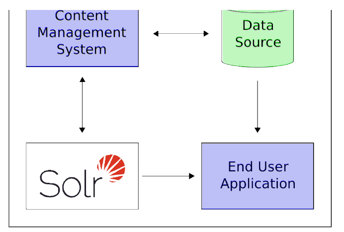

# 快速概览
如果你对Solr感兴趣，想学到它所有酷炫的功能。

这里有一个例子展示Solr如何集成到应用中：

在这个方案中Solr独立运行于其他程序。例如，一个在线商城会提供一个用户界面，一个购物车，一种可以让终端用户进行购买的途径。有一个库存应用程序可以让商店员工编辑商品信息。这些商品原数据可以保存在某些数据库中，例如Solr。

Solr可以很容易的根据以下步骤为在线商城添加搜索功能：
1. 定义schema。这个schema告诉Solr如何为文档做索引。以在线商城为例，它的schema为商品的name（名称），description（描述）,price（价格）,manufacturer（品牌）等等。Solr的schema是一个强大且灵活的，允许你修改你应用程序中Solr的行为。
2. 部署Solr。
3. 上传你要搜索的文档。
4. 在你的应用中公开搜索功能。

由于Solr基于开放标准，因此它是高可扩展的。Solr的检索是基于RESTful的，这意味着你的检索是一个简单的HTTP URL请求，相应则是一个结构化的文档：主要是XML，还包括JSON，CSV和其他的一些格式。这还意味着又各种各样的客户端都可以使用Solr，比如web浏览器，富客户端应用和移动设备。任何有HTTP功能的平台都可以与Solr沟通。查看[客户端APIs]()章节，来获取更多内容。

Solr是一个基于Apache Lucene项目的，高效，功能全面的搜索引擎。Solr提供简单的关键词搜索，多字段搜索和分面搜索。[搜索]()章节有更多的关于搜索和查询的信息。

如果Solr的强大补足语处理你海量的数据。最常见的场景就是你有大量的数据或大量的查询，单个Solr服务不足以支撑你的工作负载。在这种场景下你可以使用[SolrCloud]()跨服务器的切分数据和处理请求。组合使用不同的设置可以符合你的可扩展性需求。

比如，"Sharding(碎片化)"是一个可伸缩技术。它将一个collection分割为多个叫做"shards"的逻辑分片。这样可以扩展collection的文档数量，超越一台物理机的限制。输入的检索将被分配到collection的每一个shard，然后这些shard合并检索结果并返回。另一项可用的技术是提升你collection的"Repilication Factor(副本参数)"。它允许你添加包含collection副本的服务器，通过将检索请求分散到多台机器上来处理较大并发量的查询负载。Sharding和Replication技术并不是互斥的，它们共同使Solr成为一个强大且可扩展的平台。

更棒的是，Solr大数据量的应用并不是一种假设场景：今天很多著名的网站都在使用Solr，比如Macy，EBay(易贝)和Zappo。

更多使用Solr的产品的信息，可以参考[https://wiki.apache.org/solr/PublicServers](https://wiki.apache.org/solr/PublicServers)。

